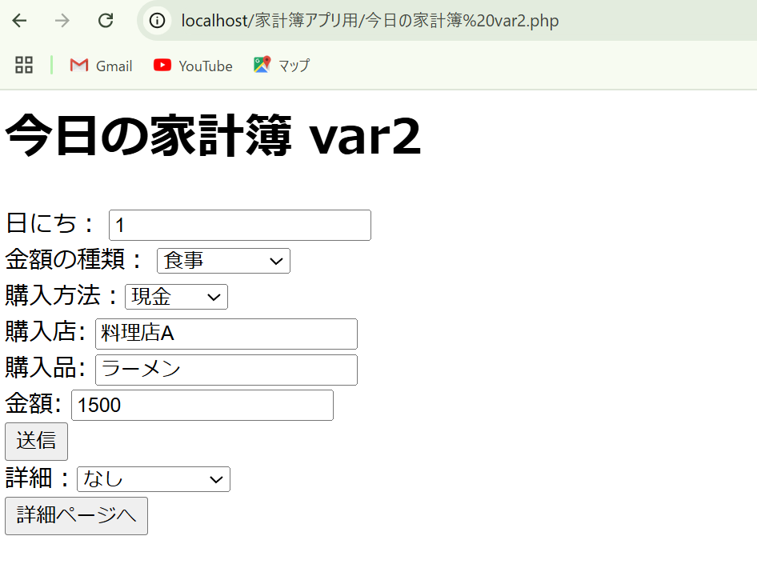

<html>
<meta http-equiv="Content-Type" content="text/html; charset=UTF-8">
<head><h1>家計簿アプリ制作</h1>h1></head>
<body>
   

このコードはMySQLの練習として作った家計簿を取るためのアプリです。

一か月ごとにデータベース内の更新が必要です。
個人で使うように制作しているので一部使いづらい部分があると思いますがご了承ください

アプリ使用には、
一定期間の家計簿を制作する際の補助アプリです。

使用にはXAMPP Control Panel v3.2.4　をダウンロードし、
ファイル内　htdocs内に　"家計簿アプリ用のファイル"　といったファイルを作りコードを保存。
XAMPPでApache MySQLを起動(start)
データベース　"kakeibo"　を作成。
Webにてlocalhost入力ファイルから　”今日の家計簿”　を起動。
以上の事前作業が必要になります。

使用方法
初期使用の際は詳細から
１お金の使い方・・・食費、日用品、サブスク等のお金の使用例を入力
　　　＊チャージ（PayPay）入金　、　貯金（貯金箱等個別の貯金）、　引き出し（銀行引き出し）を入力することでショートカットを利用できます。
   
２支払方法・・・現金、PayPay、クレカ等の支払方法の入力
　　　＊現在　"現金"、"PayPay"、"クレカ"、"貯金"、"その他"　の５つ以外が計算できなくなってしまっています。
   
３前期繰越・・・２で入力したものの初期費用を入力
の順番に入力。

その後今日の家計簿より
日にち(当日の場合は入力なしでもよい)使用例、購入方法、店舗名、購入品、金額それぞれを入力し送信を押すことで保存できます。
保存したものは購入詳細で確認、各詳細で残りの所持金、各使用料等が確認できます。
給料等支払方法ごとに収入があった場合は今月の収入から入力。
　　　＊チャージ（PayPay）入金　、　貯金（貯金箱等個別の貯金）、　引き出し（銀行引き出し）を使用していない場合はここで収入として処理＋今日の家計簿で減額の処理の２工程を行う必要があります。

１月１０日現在
</body>
</html>

